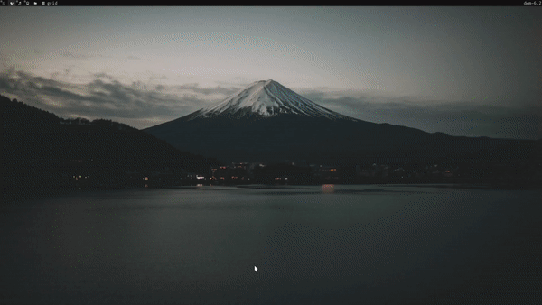

# Pokemon colorscripts

A script to print out images of pokemon to the terminal. Inspired by
[DT's colorscripts compilation](https://gitlab.com/dwt1/shell-color-scripts)

## Description
Prints out colored unicode sprites of pokemon onto your terminal. Contains
almost 900 pokemon from gen 1 to gen 8. Has all the pokemons you could ever want
(okay it doesn't have shiny pokemon or different forms, but cut me some slack)

## Visuals
### Demo GIFs
Demo of the program being used


Demo of the program running on terminal startup.



### Screenshots


## Requirements
The program itself is just a shell script that prints out custom color formatted
text files. So as long as you have a POSIX compliant shell like dash, bash, zsh etc.
As your shell the script should work.
You will however need a terminal with true color support, which most
modern terminals have. More on terminals and color support can be found in
[this gist](https://gist.github.com/XVilka/8346728)

## Installation

### On Arch or Arch based distros
The utility is available as an AUR package
[pokemon-colorscripts-git](https://aur.archlinux.org/packages/pokemon-colorscripts-git).
You can install this manually or using an AUR helper. For manual installation,
download the PKGBUILD file from this repository. Then run
```
makepkg -cf
```
which will create a .pkg.tar.zst file. Then run
```
sudo pacman -U <filename.pkg.tar.zst>
```

Or you can use an AUR Helper such as yay and run
```
yay -S pokemon-colorscripts-git
```

### On other distros
Clone or download the repository
```
git clone https://gitlab.com/phoneybadger/pokemon-colorscripts.git
```
`cd` into the directory and run the install script
```
cd pokemon-colorscripts
sudo ./install.sh
```
Now the program should be installed. You can check this by running
```
pokemon-colorscripts
```
Which should print out the help page for the program

### MacOS

Make sure coreutils are installed
```sh
brew install coreutils
```

Clone or download the repository
```
git clone https://gitlab.com/phoneybadger/pokemon-colorscripts.git
```
`cd` into the directory and run the install script
```
cd pokemon-colorscripts
sudo ./install-mac.sh
```

Restart the terminal.
Now the program should be installed. You can check this by running
```
pokemon-colorscripts
```
Which should print out the help page for the program

## Usage
You can run the program from the command line to either display a pokemon of your
choice by specifying the pokemon name or make it display a random pokemon.
```
Usage: pokemon-colorscripts [OPTION] [POKEMON NAME]
  -h, --help, help    	Print this help.
  -l, --list, list    	Print list of all pokemon
  -r, --random, random	Show a random pokemon
  -n, --name          	Select pokemon by name. Generally spelled like in the games.
                        a few exceptions are nidoran-f,nidoran-m,mr-mime,farfetchd,flabebe
                        type-null etc. Perhaps grep the output of --list if in
                        doubt
```

Example of printing out a specific pokemon
```
pokemon-colorscripts -n charizard
```
Example of printing out a random pokemon
```
pokemon-colorscripts -r
```
Some pokemon with spaces or periods or other special characters in their name
might not be spelled as expected, some examples include:
```
farfetch'd -> farfetchd
mr.mime -> mr-mime
```
These are rare exceptions, and if required you can parse the `--list` page to see
the names of all the pokemon.

### Running on terminal startup
You can display a random pokemon whenever a terminal gets launched by adding
the `pokemon-colorscripts -r` command to your *.bash_profile* or .*zsh_profile*.

### Location of the files
The program is located at /opt/pokemon-colorscripts/ with the script being symlinked to /usr/bin/

## How it works
The program itself is a simple bash script that prints out text files corresponding
to the relevant pokemon or a randomly selected pokemon. The textfiles formatted with
appropriate colors can be found in the *colorscripts* folder. The sprites
were taken from [pokemondb](https://pokemondb.net/sprites) and were converted into text
files using a custom python script after some preprocessing. A simple script to
scrape and download all the sprites, and a python script to convert these sprites into properly formatted and colored
text files, they are also included in the repo and can be found in the *generator_scripts* folder.

## Author
Phoney badger:
https://gitlab.com/phoneybadger

## License
The MIT License (MIT)


